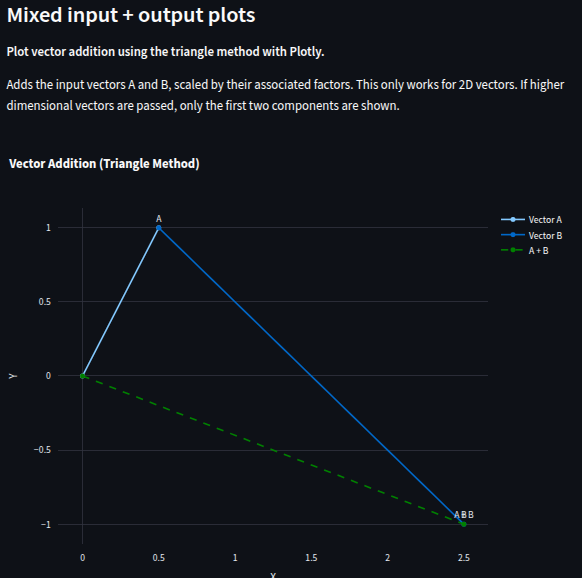

# Tesseract Streamlit

A CLI tool that generates a Streamlit app from a running [Tesseract](https://github.com/pasteurlabs/tesseract-core) instance.
The generated app allows users to interactively submit input to the `apply` endpoint and optionally visualise results using custom plotting functions.

## ✨ Features

* 🔍 Parses Tesseract's OpenAPI schema
* ⚙️ Automatically builds input forms for the `apply` endpoint
* 📊 Supports user-defined plotting of inputs and outputs
* 🚀 Outputs a ready-to-run Streamlit app script
* 🧩 Modular and customizable with minimal boilerplate

## 🛠 Requirements

- Modern UNIX based OS (Linux or macOS), or Windows with WSL
- Python >= 3.10
- [tesseract-core][tesscore]

## 📦 Installation

```bash
pip install tesseract-streamlit
```

## 🧰 Usage

```bash
tesseract-streamlit [OPTIONS] URL OUTPUT
```

* `URL`: The address to the Tesseract instance you want to interface with.
* `OUTPUT`: The file path to write the generated Streamlit app.

### ⚙️ Options

| Option                 | Description                                                        |
| ---------------------- | ------------------------------------------------------------------ |
| `--user-code, -u`      | (Optional) Path to Python file with plotting functions             |
| `--help`               | Show the help message and exit                                     |

### 📊 With Custom Plotting

You can optionally pass a Python file containing user-defined functions for plotting inputs and/or outputs.

```bash
tesseract-streamlit --user-code udf.py http://localhost:48819 app.py
```

The `udf.py` file should define functions like:

```python
import plotly.graph_objects as go

def plot(inputs, outputs) -> go.Figure:
    """Title of the plot.

    Description of what the plot conveys. Will be displayed above the
    plot itself.
    """
    fig = go.Figure()
    # some plotly logic to visualise input_schema and output_schema
    return fig
```

Where we have chosen Plotly as our plotting back-end, but [any supported library by Streamlit is allowed][stplots].

<details>
<summary>⚙️ More info on defining custom plotting functions</summary>
<br />

Custom plotting is easy and flexible. Here’s how to make the most of it:


- Function names don't matter, so name them however you like.
- Define multiple functions to visualise more than one aspect of the data. Each one will generate a separate plot in the Streamlit app.
- Add a docstring to each function to add descriptive text in the app:
    - **First line** of the docstring will appear as the **plot title**.
    - Remaining lines will be shown as a **description** below the title.
    - Omitting docstrings is allowed, but raises a `UserDefinedFunctionWarning`.
- Public functions must include either `inputs`, `outputs`, or both as parameter names. Any public function that doesn't use these names will raise a `UserDefinedFunctionError`.
- Private functions may be defined with a leading underscore in their name, *eg.* `def _foo(x: float) -> float: ...`.
    - Arbitrary parameters and return types are allowed.
    - Will not produce plots directly in the Web UI.
    - Can be called from within your public plotting functions.


This setup gives you control over what to display and how to explain it, directly from your code.
</details>

## 📁 Example

See the example README for a basic example walk-through, or simply run the following script to see the end result!

```bash
bash examples/run.sh
```

This will open a browser window with the Streamlit UI where users can input values and visualise the response.

|  |  |
| --------------------------------- | ---------------------------- |
|         |     |

## ⚠️ Current Limitations

While `tesseract-streamlit` supports Tesseracts with an `InputSchema` formed with arbitrary nesting of Pydantic models, it **does not yet support** nesting Pydantic models **inside native Python collection types** such as:

- ❌ `list[Model]`
- ❌ `tuple[Model, ...]`
- ❌ `dict[str, Model]`

These types will raise an error or be ignored in the generated app.

You **can** however use these native collections with basic Python types, such as:

- ✅ `list[str]`
- ✅ `dict[str, int]`
- ✅ `tuple[float, float]`

If you would like to request support for nested models within collections in a future release, please let us know.

[stplots]: https://docs.streamlit.io/develop/api-reference/charts#advanced-chart-elements
[tesscore]: https://github.com/pasteurlabs/tesseract-core
