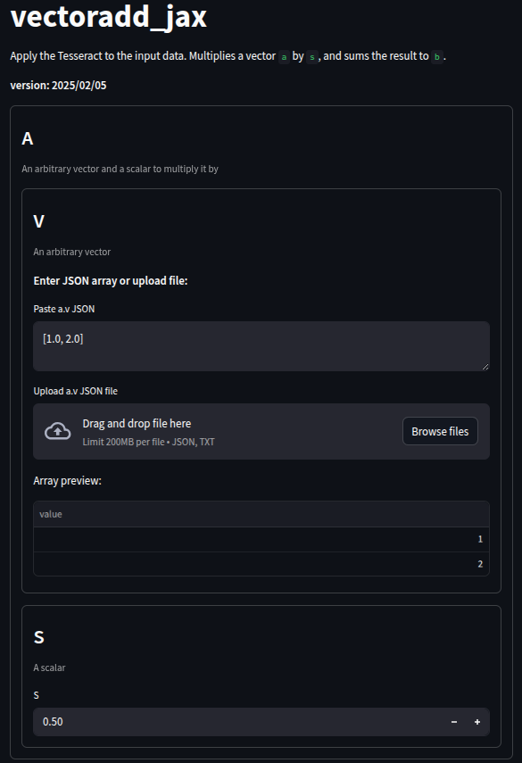
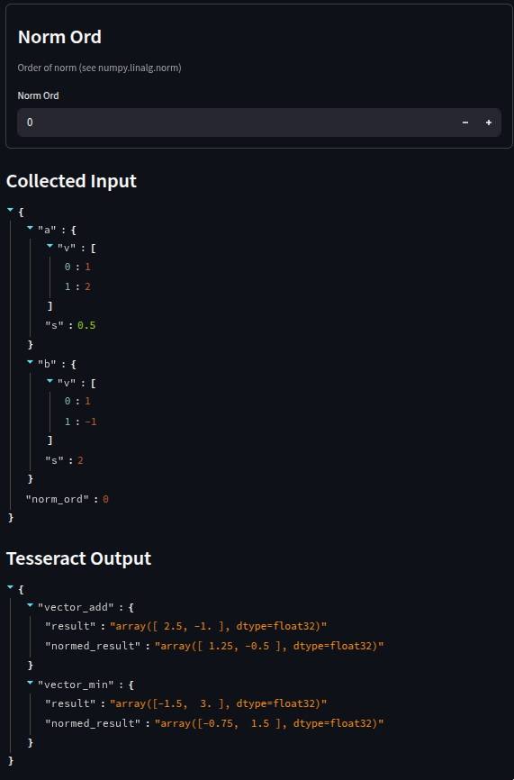
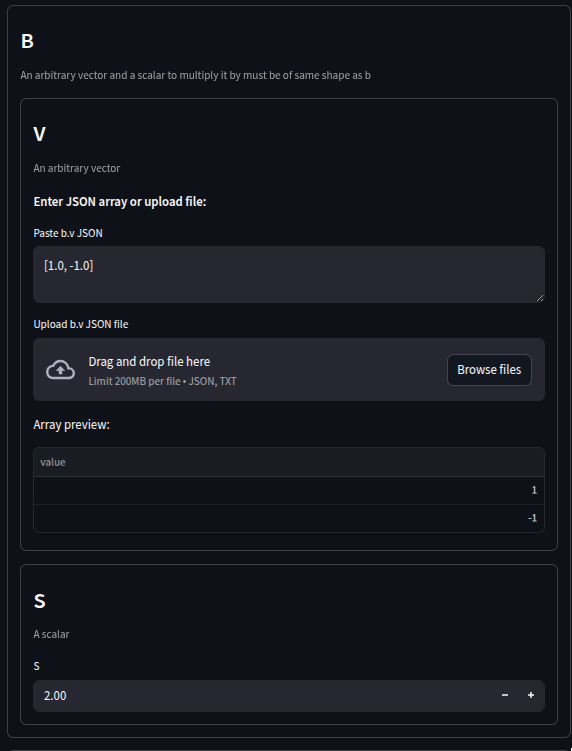
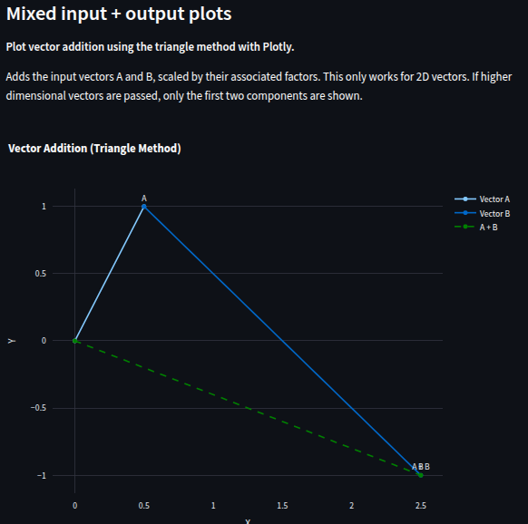

# vectoradd_jax

First, we need to download the example code. Let's clone the `tesseract-core`
repo at version `0.9.0` (which is what this example was written with).
We do this at a depth of 1 to prevent cloning the repo's whole history.

```shell
git clone --depth 1 --branch v0.9.0 https://github.com/pasteurlabs/tesseract-core.git ~/Downloads/tesseract-core
```

`tesseract-streamlit` gives users the option to pass some custom code, see
the info about `udf.py` later.
You can use whatever packages you like to write this code; for this example,
we have put the required packages in `requirements.txt`.

```shell
pip install -r requirements.txt
```

Next, we can build and serve `vectoradd_jax`, which is the Tesseracct we will
be creating a Streamlit app for here.

```shell
tesseract build ~/Downloads/tesseract-core/examples/vectoradd_jax
tesseract serve vectoradd_jax
```

Make a note of the `port` and `project_id` randomly assigned by
`tesseract serve`, which will print to `stdout`, as it will be useful in the
next steps.

If you haven't already followed the [installation guide](../README.md#-installation) to
install `tesseract-streamlit`, we recommend doing this now.
We will use the command of the same name that comes with the package to
automatically generate the Streamlit app!

```shell
tesseract-streamlit --user-code udf.py "http://localhost:<PORT>" app.py
```

Here we have passed `udf.py`, which contains a single user-defined function
(hence the name). It takes the inputs and outputs from the Tesseract, and
returns a Plotly figure. You aren't limited to using Plotly, any visualisation
library supported by Streamlit is fine. The list can be seen [here][stplots].
Users may also write functions to plot the inputs or outputs alone.

Functions may have any name, and the docstrings will be used as descriptions
in the web-app accompanying the plots.
Just make sure to name the parameters `input_schema` and / or `output_schema`
accordingly, and `tesseract-streamlit` will handle the rest.

Finally, we can run our app! Since we have generated a Streamlit app to call
our Tesseract, we spin it up using `streamlit run`.

```shell
streamlit run app.py
```

Hey presto! You should have a web-app with automatically generated inputs for
the `vectoradd_jax` Tesseract, with some custom visualisations!


|  |  |
| --------------------------------- | ---------------------------- |
|         |     |

When you finish up, you may want to stop serving the Tesseract. You can do this
with

```shell
tesseract teardown <PROJECT ID>
```
