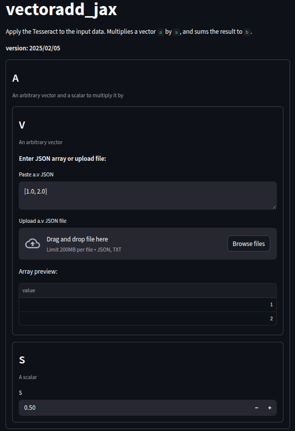
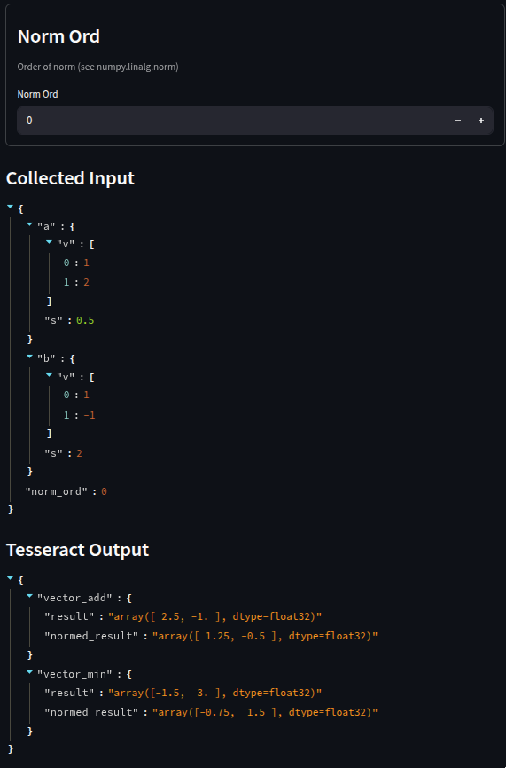
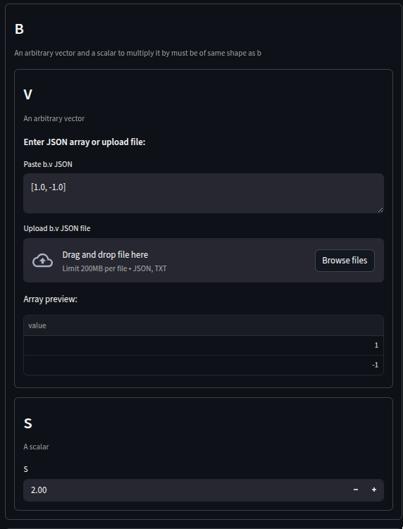
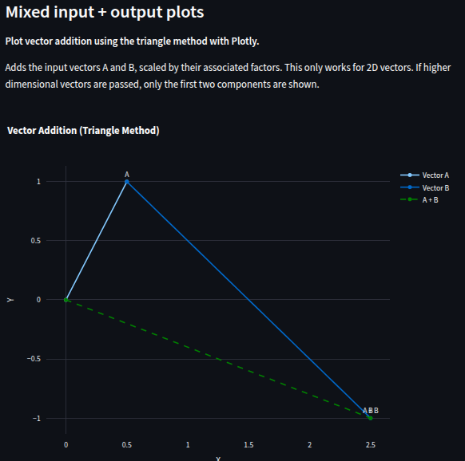

# Visualising `vectoradd_jax` with Streamlit

This example shows how to quickly generate a Streamlit app to interact with the `vectoradd_jax` Tesseract.
Using `tesseract-streamlit`, you'll get an app with autogenerated input controls and optional Python-defined visualisations — no UI code needed! 🚀

---

## 📥 Step 1: Download the Example Code

We'll use the `vectoradd_jax` example from `tesseract-core` version `v0.9.0`. Clone it with:

```shell
git clone --depth 1 --branch v0.9.0 https://github.com/pasteurlabs/tesseract-core.git ~/Downloads/tesseract-core
```

---

## 📦 Step 2: Install Requirements

Install the required packages for this example:

```bash
pip install -r requirements.txt
```

---

## 🛠️ Step 3: Build and Serve the Tesseract

Use the Tesseract CLI to build and serve `vectoradd_jax`:

```bash
tesseract build ~/Downloads/tesseract-core/examples/vectoradd_jax
tesseract serve vectoradd_jax
```

> [!NOTE]
> Make note of the `PORT` and `PROJECT ID` printed to stdout — you'll need them shortly.

---

## ⚡ Step 4: Generate and Launch the Streamlit App

With `tesseract-streamlit` installed, generate and launch the app in one step:

```bash
tesseract-streamlit --user-code udf.py "http://localhost:<PORT>"
```

This writes the app to a cache file and launches Streamlit automatically.

`udf.py` can be found in under `tesseract-streamlit/examples/vectoradd_jax/`.
It contains a custom function that takes the Tesseract's inputs and outputs and drops a Plotly-powered vector addition diagram straight into the web UI — automatically! 🎯
[Check it out](https://github.com/pasteurlabs/tesseract-streamlit/blob/main/examples/vectoradd_jax/udf.py) to see how it works.

> [!TIP]
> You can also skip Step 3 entirely and let `tesseract-streamlit` serve the Tesseract for you:
> ```bash
> tesseract-streamlit --from-image vectoradd_jax --user-code udf.py
> ```

If you prefer to generate a script to run later, pass an output path:

```bash
tesseract-streamlit --user-code udf.py "http://localhost:<PORT>" app.py
streamlit run app.py
```

This will launch a web interface for submitting inputs, running the Tesseract, and visualising the results.

---

## 🖼️ Screenshots

|  |  |
| --------------------------------- | ---------------------------- |
|         |     |

---

## 🧹 Step 6: Clean Up

When you're done, you can stop the Tesseract server with:

```bash
tesseract teardown <PROJECT ID>
```

---

🎉 That’s it — you've transformed a running Tesseract into a beautiful Streamlit web app with interactive plots, with minimal effort from the command line!
